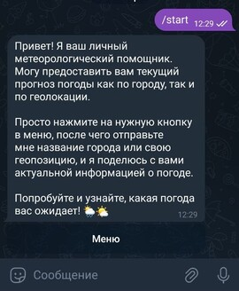
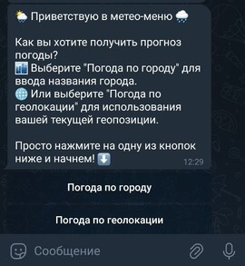
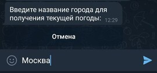
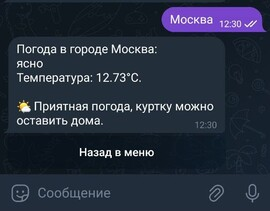
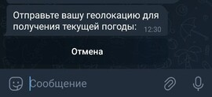
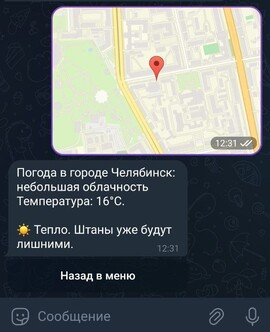

# 🌧️ Telegram МетеоБот

[](https://docs.aiogram.dev/en/latest/)
[](https://docs.aiohttp.org/en/stable/index.html)

## Описание

Телеграм-бот отправляет пользователю информацию о текущей погоде. Для получения информации
пользователю нужно выбрать способ передачи его текущей локации боту.
На данный момент есть два варианта:

| Вариант передачи локации | Описание способа                                                                                                                                                                                                                    |
|------------|-------------------------------------------------------------------------------------------------------------------------------------------------------------------------------------------------------------------------------------|
| `По городу` | Пользователь нажимает на соответствующую кнопку в меню бота. Бот переходит в режим ожидания пользовательского ввода. Пользователь отправляет свой город в ответе боту и получает погоду.                                            |
| `По геолокации` | Пользователь нажимает на соответствующую кнопку в меню бота. Бот переходит в режим ожидания пользовательского ввода. Пользователь отправляет свою геолокацию через специальный пункт во "Вложениях". Бот в ответ отправляет погоду. |

## Технические детали

- Бот использует библиотеку Aiogram для работы с Telegram API.
- Для получения данных о погоде бот обращается к API OpenWeatherMap. Вы должны зарегистрироваться и получить свой API ключ на сайте [OpenWeatherMap](https://openweathermap.org).
- Бот использует библиотеку Aiohttp для выполнения асинхронных HTTP-запросов к сервису OpenWeatherMap.
- При запуске и остановке бота отправляются соответствующие сообщения в Telegram Администратора.
- Бот логирует свою работу в отдельном файле ***bot.log***. По-стандарту выставлен уровень логирования *DEBUG*.
- После нажатия на одну из кнопок запроса погоды бот будет ожидать ответ от 
пользователя. Если пользователь пришлёт некорректный город, бот попросит
повторить запрос. Если пользователь передумал запрашивать погоду - нажатие на
кнопку **отмена** отключит состояние ожидания.

## Примеры ответов бота:

Команда /start :



Нажатие на кнопку "Меню" :



Нажатие на кнопку "Погода по городу" :



Отправка города и получение ответа :



Нажатие на кнопку "Погода по геолокации" :



Отправка геолокации и получение ответа :



## Ближайшие обновления

Будет добавлена возможность запрашивать почасовой прогноз. Он будет запрашиваться
при помощи Inline кнопок в ответе бота. Прогноз будет поделён на несколько вариантов:
за 3, 6, 12 и 24 часа. 

Будет добавлена возможность запрашивать прогноз на 1 - 5 суток по аналогии с почасовым.

## Установка
###
1. Склонируйте репозиторий:

```shell
git clone https://github.com/PrimeStr/meteo_assistant_bot.git
```

2. Перейдите в папку с проектом:

```shell
cd meteo_assistant_bot/
```

3. Установите виртуальное окружение для проекта:

> **Примечание:** Обратите внимание, что в моём случае 
> используется инструмент создания виртуальных сред **venv**, но вы можете использовать любой другой на своё усмотрение.


>###### Если у вас OS Linux и MacOS
>```shell
>python3 -m venv venv
>```
>###### Если у вас OS Windows
>```shell
>python -m venv venv
>```

4. Активируйте виртуальное окружение для проекта:

>#### `source` можно заменить на .
>   
>###### Если у вас OS Linux и MacOS
>```shell
>source venv/bin/activate
>```
>###### Если у вас OS Windows и вы используете cmd или PowerShell
>```shell
>.\venv\Scripts\activate.ps1
>```
>###### Если у вас OS Windows и вы используете Git Bash
>```shell
>source venv/Scripts/activate
>```

5. После активации виртуального окружения установите зависимости:

```shell
pip install -r requirements.txt
```

6. Зарегистрируйте telegram-бота и получите его токен. Для этого воспользуйтесь
услугами [BotFather](https://t.me/BotFather).


7. Создайте в корневой директории проекта файл .env для хранения переменных окружения. Перенесите переменные из файла .env.example. Дополните их необходимыми значениями.

```
API_TOKEN=example        # Вставьте сюда токен вашего бота
ADMIN_CHAT_ID=example    # Вставьте сюда свой Telegram ID для получения важных сообщений
WEATHER_API_KEY=example  # Вставьте сюда токен API сервиса OpenWeatherMap

# Следующие переменные вам понадобятся только в случае запуска бота на Webhooks
WEBHOOK_HOST=0.0.0.0       # Вставьте сюда белый IP вашего сервера
WEBHOOK_PORT=8443       # 443, 80, 88 или 8443 (порт должен быть 'открыт')
```

8. Для запуска сервера локально, используя polling, раскомментируйте **109 строку** в
файле **main.py**.

   
9. Запустите проект локально:

>###### Если у вас OS Linux и MacOS
>```shell
>python3 main.py
>```
>###### Если у вас OS Windows
>```shell
>python main.py
>```

## Автор

**Максим Головин**\
Вы можете заглянуть в другие мои репозитории в профиле GitHub. Нажмите [здесь](https://github.com/PrimeStr).
